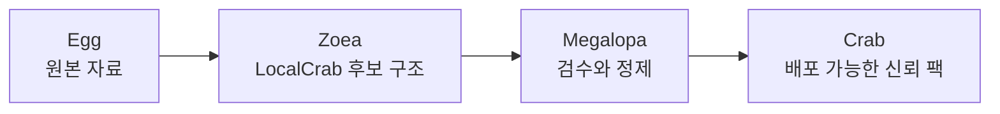

# Megalopa


Megalopa는 LocalCrab에서 만든 온톨로지 후보 팩을 OpenCrab에 배포하기 전, 근거와 관계를 검수하고 사용 위험도를 알려주는 사전 감사 레이어입니다.

[Live demo](https://megalopa.vercel.app) · [5분 시작 가이드](https://megalopa.vercel.app/docs/quick-start) · [왜 만들었나요](https://megalopa.vercel.app/docs/why-megalopa) · [OpenCrab](https://opencrab.sh)

## OpenCrab Ecosystem

Megalopa는 알렉스님의 OpenCrab 생태계와 연결되는 사전 검수 도구입니다.

- Creator / OpenCrab maintainer: [@AlexAI-MCP](https://github.com/AlexAI-MCP)
- OpenCrab SaaS: [opencrab.sh](https://opencrab.sh)
- OpenCrab repository: [AlexAI-MCP/OpenCrab](https://github.com/AlexAI-MCP/OpenCrab)

## Philosophy

그래프는 태어날 때부터 신뢰할 수 있는 것이 아닙니다. 근거, 검수, 수정의 과정을 거쳐 탈피해야 합니다.

Megalopa는 팩의 진실 여부를 판정하는 도구가 아닙니다. 대신 이 팩을 어디까지 믿고 써도 되는지, 공개 배포 전에 무엇을 먼저 고쳐야 하는지 보여줍니다.



## What Megalopa Checks

- 근거 없는 관계: 관계가 실제 근거와 연결되어 있는지 확인합니다.
- 너무 강한 주장: `causes`, `proves`처럼 단정적인 표현을 더 안전한 관계로 낮추도록 제안합니다.
- 약한 출처: 공식 문서, 논문, 책, 추적 가능한 글처럼 출처 품질을 구분합니다.
- 구조 오류: 없는 노드를 참조하는 관계, 중복 ID, 필수 필드 누락을 찾습니다.
- 편향적 명명: 사람이나 집단을 단정하는 노드 이름을 행동이나 구조 중심 표현으로 바꾸도록 돕습니다.

## Product Flow

1. LocalCrab이 만든 OpenCrab 스타일 JSON 팩을 준비합니다.
2. Megalopa에 JSON을 붙여넣거나 파일로 업로드합니다.
3. 신뢰도 점수, 사용 위험도, 먼저 고칠 문제를 확인합니다.
4. 리포트의 수정 체크리스트를 따라 근거, 출처, 관계 표현, 명명을 고칩니다.
5. 다시 분석해 위험한 관계가 줄었는지 확인한 뒤 OpenCrab 배포를 준비합니다.

처음 사용하는 경우 [5분 시작 가이드](https://megalopa.vercel.app/docs/quick-start)를 먼저 보면 됩니다.

## Main Screens

- Landing: Egg -> Zoea -> Megalopa -> Crab 성장 은유와 제품 철학을 설명합니다.
- Upload: 샘플 팩, JSON 붙여넣기, JSON 파일 업로드를 지원합니다.
- Dashboard: 점수보다 먼저 사용 위험도와 핵심 신호를 보여줍니다.
- Report: 구조화된 수정 큐와 Markdown 리포트를 함께 제공합니다.
- Guide: 일반 사용자도 이해할 수 있도록 용어, 작동 방식, 리포트 읽는 법, 수정 방법을 설명합니다.

## Score Model

점수는 진리 점수가 아니라 사용 위험도 안내입니다.

| Component | Points |
| --- | ---: |
| Evidence Coverage | 25 |
| Relation Quality | 20 |
| Schema Consistency | 15 |
| Provenance Quality | 15 |
| Consensus Strength | 10 |
| Recency | 5 |
| Inference Utility | 10 |

사용 등급은 `trusted`, `usable_with_citation`, `exploratory`, `private_only`, `quarantine`으로 나뉩니다.

## Pack Shape

현재 UI는 OpenCrab 스타일 JSON 팩을 기준으로 동작합니다.

```json
{
  "id": "example-pack",
  "title": "Example Pack",
  "version": "0.1.0",
  "description": "Ontology pack description",
  "nodes": [],
  "edges": [],
  "evidence": []
}
```

핵심 필드는 `nodes`, `edges`, `evidence`, 그리고 각 노드와 관계의 `evidence_ids`입니다.

## Assets

브랜드 에셋은 `app/asset`에 있습니다.

- `egg-*`: 원본 자료 단계
- `zoea-*`: LocalCrab 후보 구조 단계
- `megalopa-*`: 검수와 정제 단계
- `crab-*`: 배포 가능한 신뢰 팩 단계
- `megalopa-wordmark-dark_2.png`: 링크 미리보기와 GitHub README용 대표 이미지

OpenGraph 이미지는 크롤러 호환성을 위해 `public/og/megalopa-wordmark-dark-2.png`에도 배치되어 있습니다.

## Run Locally

```bash
npm install
npm run dev
```

Local URL:

```text
http://127.0.0.1:3100
```

Sample analyzer command:

```bash
npm run analyze:sample
```

Tests:

```bash
npm run test:py
```

## Tech Stack

- Next.js App Router
- TypeScript
- Tailwind CSS
- Deterministic rule-based analyzer
- Python package and pytest coverage for core analysis behavior

## Current Scope

- JSON pack input
- Node, edge, evidence parsing
- Schema consistency checks
- Missing evidence detection
- Unsupported and too-strong relation warnings
- Weak provenance warnings
- Bias naming warnings
- Reliability score and Markdown report generation

Planned next steps include durable report storage, YAML input, graph visualization, and downloadable repaired pack export.
